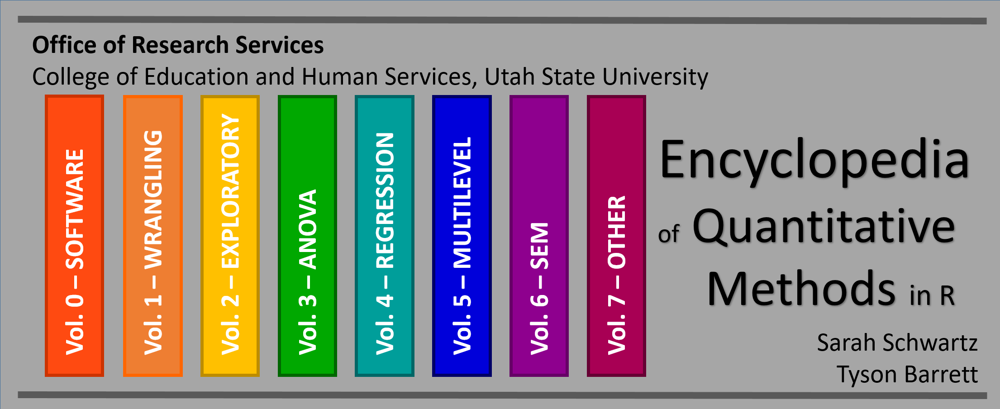

## Background

This encyclopedia of eBooks is being developed by the [Office of Research Services](https://cehs.usu.edu/research/index) to serves the faculty and graduate students in the [College of Education and Human Services](https://cehs.usu.edu/) at [Utah State University](http://www.usu.edu/).  

## Purposes

The three main purposes are to: 

* Provide reference material for **graduate quantitative methods courses** *(EDUC/PSY 6600, EDUC/PSY 7610, PSY 7650, ect.)*  
* Support **college wide workshops** given by the [Statistical Consulting Studio](https://cehs.usu.edu/research/statstudio/index) and [Data Science and Discover Unit](https://cehs.usu.edu/research/dsdu/index)
* Facilitate **individual consultations** with the authors pertaining to research.

{width=350px}

